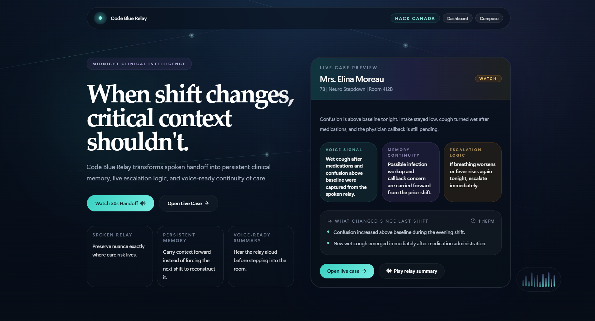

# Code Blue Relay

**Live Demo:** https://code-blue-relay.vercel.app/  
**Featured Case:** https://code-blue-relay.vercel.app/case/elina-moreau

Code Blue Relay is a voice-first clinical handoff experience that turns spoken shift report into persistent case memory. It preserves the nuance that is usually lost during shift change and converts it into a clear continuity layer for the next clinician.

## Overview

Clinical handoff is often rich in context but fragile in practice. Subtle details such as worsening confusion, a new wet cough after medication, or an unanswered physician callback can live only in speech. Code Blue Relay captures those signals, structures them, and carries them forward so the incoming shift inherits context instead of reconstructing it.

## What This Project Delivers

- Spoken or typed handoff captured as a relay
- Structured clinical memory extracted from the raw narrative
- Carried-forward unresolved concerns from previous shifts
- Persistent escalation logic tied to the patient story
- Voice-ready summaries for rapid pre-room review
- A polished end-to-end experience from landing page to live case detail

## Product Experience

The experience is designed to communicate the value of continuity of care quickly and clearly:

- **Landing page:** frames the problem and introduces the live case
- **Dashboard:** surfaces active cases by status and urgency
- **Compose workspace:** shows how a raw handoff becomes structured memory
- **Case detail view:** combines transcript, memory, follow-up, escalation triggers, and audio summary in a single continuity layer

## Featured Scenario

The primary scenario follows **Mrs. Elina Moreau**, a 78-year-old neuro stepdown patient on overnight watch. Her case includes worsening confusion, poor intake, a new wet cough after medications, and a pending physician callback. This scenario demonstrates why spoken nuance matters and how Code Blue Relay turns that nuance into actionable continuity.

## Why It Matters

- Continuity of care improves when the next shift receives context instead of fragments
- Escalation thresholds are safer when they are persisted instead of remembered
- Voice preserves nuance that checklist-only handoff often loses
- The product makes risk visible before the next clinician steps into the room

## Technical Execution

Code Blue Relay is built with a modern frontend stack focused on clarity, responsiveness, and demo reliability:

- Next.js App Router
- TypeScript
- Tailwind CSS
- shadcn/ui
- Framer Motion
- Adapter-based integrations for clinical memory, speech, and data services

## Project Goal

This project explores a simple but high-impact idea: shift handoff should preserve clinical memory, not just transmit notes. Code Blue Relay shows how spoken narrative can become durable context, faster review, and more confident escalation decisions.
